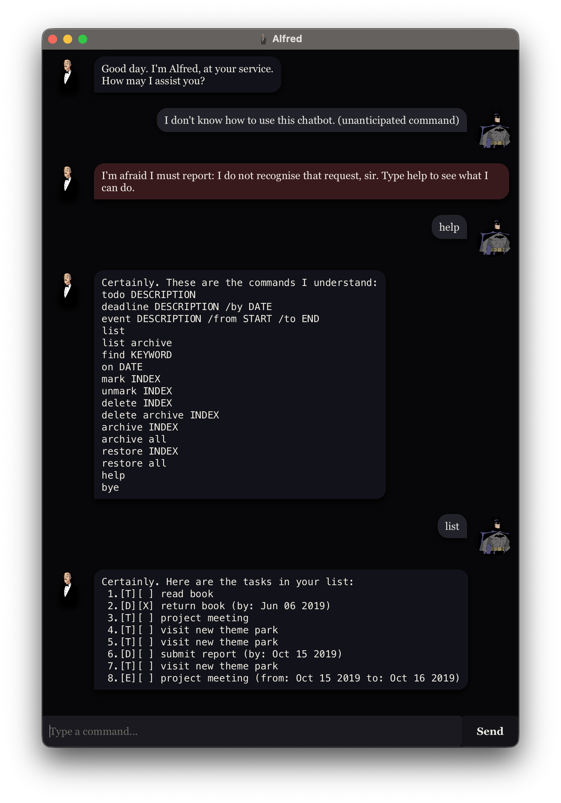

# Alfred User Guide

**Alfred** is a desktop chatbot for managing todos, deadlines, and events. It is built for typing commands quickly, with a chat window so you can see replies as you go.

If you type `help`, Alfred lists every command. Errors appear in a darker red bubble. Numbered lists use a monospaced font so the columns line up.

## Quick start

1. Ensure Java 25 is installed.
2. Copy `alfred.jar` into an empty folder and open a terminal there.
3. Run `java -jar alfred.jar`. Alfred’s window should appear in a few seconds.
4. Type a command in the box at the bottom and press Enter or **Send**. Try `help`, then `todo read book`, then `list`.
5. Type `bye` to close the app.

You can also run Alfred from the project with `./gradlew run` (macOS / Linux) or `gradlew run` (Windows).

Tasks are saved automatically in `data/alfred.txt` next to the JAR (or in the folder you ran the command from). You do not need to save by hand.

## Command format

* Words in `UPPER_CASE` are values you type. In `todo DESCRIPTION`, replace `DESCRIPTION` with `read book`.
* Command words are **case-sensitive** and must be the first word on the line. `List` is not `list`.
* Type **one command per line**.
* `help`, `list`, and `bye` take no extra text.
* `INDEX` is the number shown by `list` (live tasks) or `list archive` (archived tasks). Numbering starts at 1.
* Dates use `yyyy-MM-dd` (for example `2019-10-15`) or `d/M/yyyy` (for example `2/12/2019`). You may add a 24-hour time as `HHmm` (`1800`) or with a colon (`18:00`). Words such as `Sunday` are rejected.
* Dates display as `MMM dd yyyy` (for example `Oct 15 2019`). Times display as `MMM dd yyyy, h:mma` (for example `Dec 02 2019, 6:00PM`).

If Alfred does not recognise a command, it tells you to type `help`. Bad arguments, invalid dates, and out-of-range numbers are reported as errors and do not change your list.

## Features

### Viewing help: `help`

Shows a compact list of commands Alfred understands.

Format: `help`

### Adding a todo: `todo`

Adds a todo. The description cannot be blank.

Format: `todo DESCRIPTION`

Example:

* `todo read book` stores `[T][ ] read book`

### Adding a deadline: `deadline`

Adds a deadline with a due date or date-time.

Format: `deadline DESCRIPTION /by DATE`

Examples:

* `deadline submit report /by 2019-10-15`
* `deadline return book /by 2/12/2019 1800`

Shown as `[D][ ] submit report (by: Oct 15 2019)`.

### Adding an event: `event`

Adds an event with a start and end. `/from` must come before `/to`, and the end cannot be earlier than the start.

Format: `event DESCRIPTION /from START /to END`

Example:

* `event project meeting /from 2019-10-15 /to 2019-10-16`

Shown as `[E][ ] project meeting (from: Oct 15 2019 to: Oct 16 2019)`.

### Listing live tasks: `list`

Shows every live (not archived) task in the order you added them, numbered from 1.

Format: `list`

Use these numbers with `mark`, `unmark`, `delete`, and `archive`.

### Listing archived tasks: `list archive`

Shows archived tasks, numbered from 1 among archived tasks only. If none are archived, Alfred replies `None, sir.`

Format: `list archive`

Use these numbers with `restore` and `delete archive`.

### Finding tasks: `find`

Lists live tasks whose description contains `KEYWORD`, ignoring case. Date and time text is not searched. Archived tasks are skipped. Matches are numbered from 1 in the order they appear.

Format: `find KEYWORD`

`KEYWORD` may contain spaces. `find return book` looks for that whole phrase.

Example:

* `find book`

If nothing matches, Alfred replies `None, sir.`

### Tasks on a date: `on`

Lists live deadlines due on that calendar date, and live events whose start-to-end range includes it. Todos never match. Matching tasks keep their current `list` numbers.

Format: `on DATE`

Example:

* `on 2019-10-15`

If nothing matches, Alfred replies `None, sir.`

### Marking a task: `mark` / `unmark`

Marks the live task at that `list` number as done (`[X]`) or not done (`[ ]`).

Format: `mark INDEX` / `unmark INDEX`

Examples:

* `mark 2`
* `unmark 2`

### Deleting a live task: `delete`

Permanently removes the live task at that `list` number. Later live tasks are renumbered. This does not archive the task.

Format: `delete INDEX`

Example:

* `delete 2`

### Archiving tasks: `archive`

Hides a live task from `list`, `find`, `on`, `mark`, `unmark`, and `delete` without deleting it. The task stays in the save file.

Format: `archive INDEX` or `archive all`

* `archive INDEX` archives that live task.
* `archive all` archives every remaining live task. If the live list is already empty, Alfred reports an error. If that leaves no live tasks, Alfred also says `Your list is empty.`

Examples:

* `archive 2`
* `archive all`

Alfred reports how many tasks were archived, using `N tasks` even when the count is 1.

### Restoring tasks: `restore`

Moves an archived task back to the end of the live list.

Format: `restore INDEX` or `restore all`

* `restore INDEX` uses the number from `list archive`.
* `restore all` restores every archived task, in archive-list order. If nothing is archived, Alfred reports an error.

Examples:

* `restore 1`
* `restore all`

### Deleting an archived task: `delete archive`

Permanently removes the archived task at that `list archive` number. There is no bulk archive delete.

Format: `delete archive INDEX`

Example:

* `delete archive 1`

### Exiting: `bye`

Ends the session. Alfred replies `Until next time. I shall be here should you require me.` In the GUI, the window closes after a short pause.

Format: `bye`

## Saving the data

Alfred writes the list after every add, mark, unmark, delete, archive, or restore. The file is `data/alfred.txt` in the folder you started Alfred from.

If the file cannot be read on startup, Alfred starts with an empty list and reports an error. Corrupted lines are skipped. Editing the file by hand is possible but not recommended.

## Command summary

| Action | Format |
| --- | --- |
| Help | `help` |
| Add todo | `todo DESCRIPTION` |
| Add deadline | `deadline DESCRIPTION /by DATE` |
| Add event | `event DESCRIPTION /from START /to END` |
| List live tasks | `list` |
| List archived tasks | `list archive` |
| Find | `find KEYWORD` |
| Tasks on a date | `on DATE` |
| Mark / unmark | `mark INDEX` / `unmark INDEX` |
| Delete live task | `delete INDEX` |
| Archive | `archive INDEX` / `archive all` |
| Restore | `restore INDEX` / `restore all` |
| Delete archived task | `delete archive INDEX` |
| Exit | `bye` |
